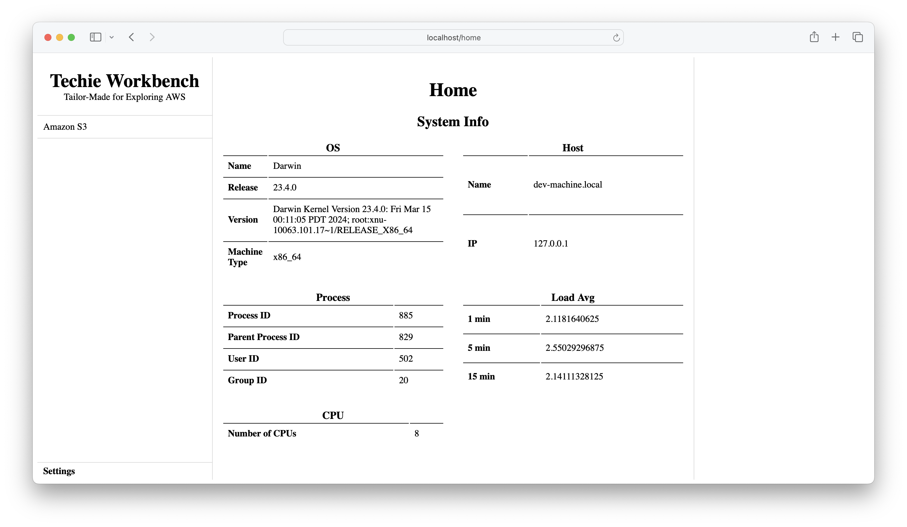
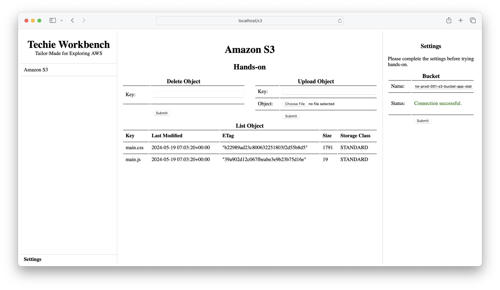

# Techie Workbench, Tailor-Made for Exploring AWS

This application is designed to demonstrate how to deploy an application on the AWS cloud and integrate AWS services using the AWS SDK.





## Dev Environment Setup

This application will run on an **Amazon Linux 2023** instance in the AWS cloud. For the development environment, use a **Fedora Linux** VM. Follow the articles to build a VM on your local machine.

1. [How to Automate Linux VM Building on a Windows Machine — Part 1](https://medium.com/@sathiyaraj-sridhar/how-to-install-virtualbox-vagrant-and-git-bash-on-windows-aa2362a8689)
2. [How to Automate Linux VM Building on a Windows Machine — Part 2](https://medium.com/@sathiyaraj-sridhar/how-to-automate-vm-building-on-windows-machine-part-2-896c28d879e6)


## App Setup

### Install

- Download the source code. If you don't have `git`, install it by running `sudo yum install git`.

```bash
git clone https://github.com/sathiyaraj-sridhar/techie-workbench.git
cd techie-workbench
```

- Create a virtual environment. If you don't have `venv` module install it by running `python3 -m pip install virtualenv`.

```bash
python3 -m venv venv
source venv/bin/activate
```

- Install required Python packages.

```bash
python -m pip install -r source/requirements.txt
```


### Configure

- Export the AWS profile to ensure the AWS SDK uses those credentials.

```
export AWS_PROFILE='bob'
export AWS_DEFAULT_REGION=us-west-2
```


### Start

- Run the application. Ensure you are in the `source` directory.

```bash
python source/app.py --port=2000
```

- Access the application at http://10.1.1.5:2000


### Stop

- The app is running in the foreground. Press CTRL+C (SIGINT) to gracefully terminate the foreground process.


## Redis Setup

### Install

- Ensure that the necessary dependency packages are available on your system to build Redis from source.

```
sudo dnf install make,gcc
```

- Download the Redis source file.

```
cd /tmp
curl -O https://download.redis.io/redis-stable.tar.gz
```

- Compile Redis.

```
tar -xzvf redis-stable.tar.gz
cd redis-stable
make
```

- If your compilation succeeds, you will find the Redis binaries in the `src` directory. Let's install these binaries in `/usr/local/bin`.

```
sudo make install
```


### Start

- Run the Redis in-memory database.

```
redis-server --protected-mode no
```

- Verify client connections.

```
redis-cli CLIENT LIST
```


### Stop

- The Redis is running in the foreground. Press CTRL+C (SIGINT) to gracefully terminate the foreground process.
